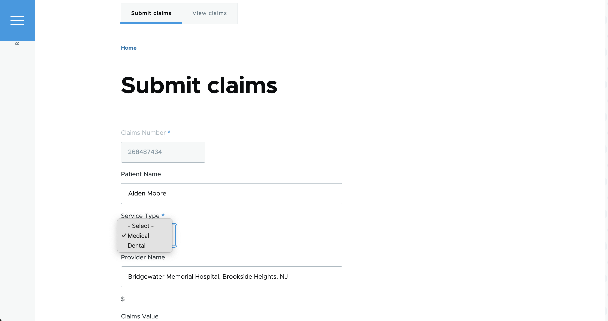
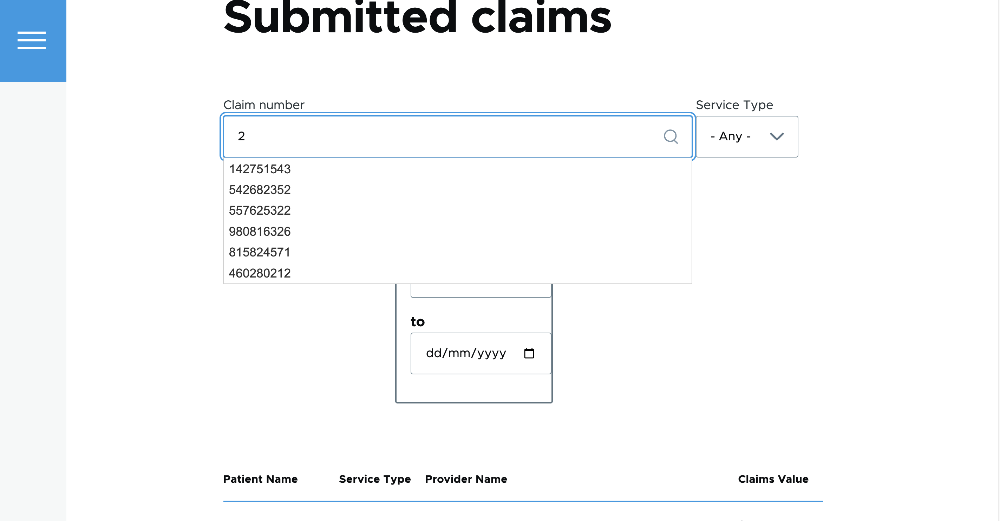
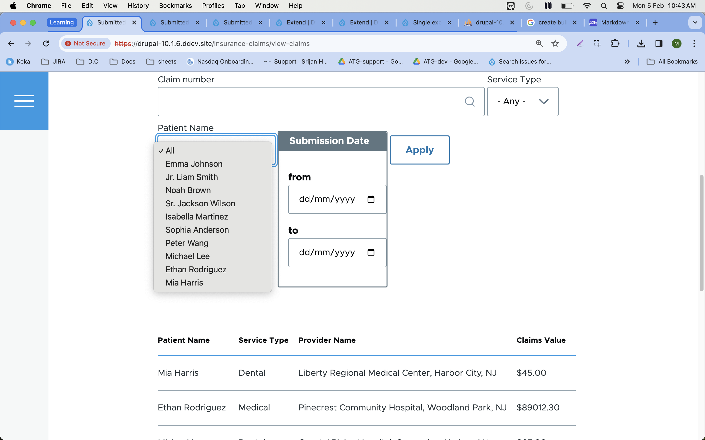
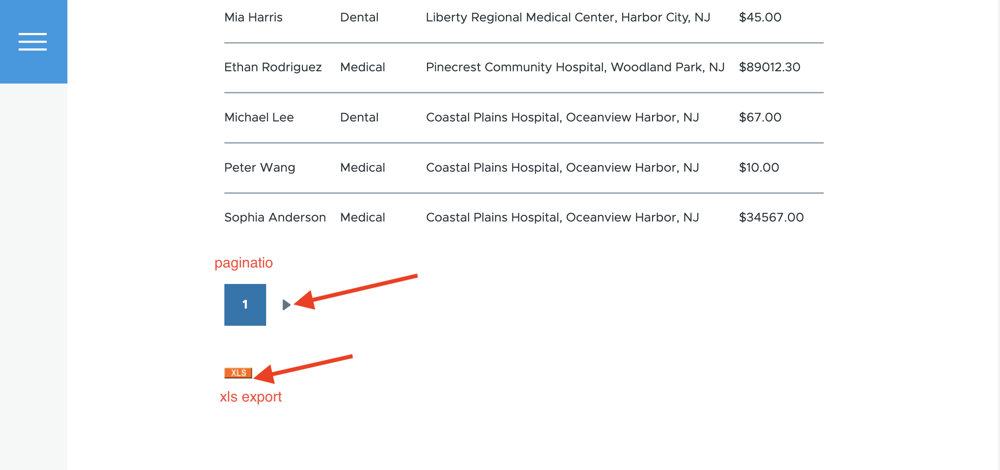

Insurance Claims Custom Entity- adding and listing and Mangaged by view and filters

# Implementation Details

- Created content type (insurance_claims) and defined fields.
- Created Route and Tabs to the Submit Claims and View Claims Tabs.
- Created form and saved the data to the content type.
- Created a view with a limit of 5 with pagination and added the filters.
- To show the claim number as an autocomplete exposed filter, alter the field via `hook_form_views_exposed_form_alter`.
- To show the patient name as a dropdown exposed filter, altered the field via hook_form_views_exposed_form_alter.
- To show the Start and End date filter, `drupal/date_filter` module is used.
- To export the data via xls,  `views_data_export`  and `xls_views_data_export` modules used.
- To save the data to JSON and using it, we can make use of views_data_export. Add a data  export in JSON format that will expose a URL through which we can collect the JSON data. Additionally we can save the data in a json file (included in the code) and specify the file to a view using a contrib module . for eg: `views_json_source` (https://www.drupal.org/project/views_json_source)

## Screenshots

### Submit Claim

### Claim number autocomplete

### Patient Name dropdown

### Pagination and xls export

